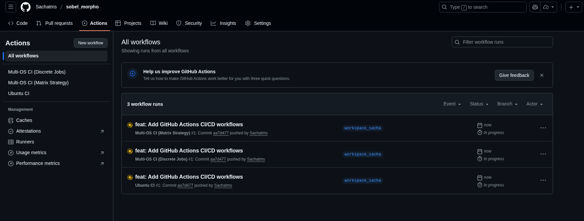

# Lab 2 Note - Git Commands and GitHub Actions

The objective of this practical assignment is to manipulate and understand advanced Git functionalities, including cherry-picking, rebasing, pull requests, hooks, and GitHub Actions CI/CD workflows.

---

## Setup: Fork and Clone the Repository

> **Assignment** - Fork the repository [https://github.com/QLOG-5EII/sobel_morpho](https://github.com/QLOG-5EII/sobel_morpho) to your GitHub account, clone it locally, and create a working branch.

### Steps Completed

1. **Fork the repository using GitHub CLI:**
   ```bash
   gh repo fork QLOG-5EII/sobel_morpho --clone=true --remote=true lab2_git
   ```

   This command:
   - Creates a fork at `Sachatms/sobel_morpho` on GitHub
   - Clones the fork into the `lab2_git` folder
   - Sets up two remotes:
     - `origin` → Your fork (`sachatms/sobel_morpho`)
     - `upstream` → Original repo (`QLOG-5EII/sobel_morpho`)

2. **Create a working branch:**
   ```bash
   cd lab2_git
   git checkout -b workspace_sacha
   ```

3. **Verify the setup:**
   ```bash
   git branch -a
   ```

   Available branches:
   - `main` (local, current base)
   - `workspace_sacha` (local, working branch) ✅
   - `remotes/origin/main` (your fork)
   - `remotes/origin/other-branch` (your fork)
   - `remotes/upstream/main` (original repo)
   - `remotes/upstream/other-branch` (original repo - **to be cherry-picked later**)

### Repository Structure

The project is a C-based image processing application that applies Sobel/Dilation/Erosion filters to video:

```
lab2_git/
├── CMakeLists.txt          # CMake build configuration
├── README.md               # Project documentation
└── src/
    ├── main.c              # Main entry point
    ├── sobel.c             # Sobel filter implementation
    ├── sobel.h             # Sobel filter header
    ├── yuvRead.c           # YUV video reading
    ├── yuvRead.h
    ├── yuvDisplay.c        # SDL2-based video display
    └── yuvDisplay.h
```

---

## Part 1: Cherry-Pick from Another Branch

> **Assignment** - Retrieve a commit from the `other-branch` and copy it to your working branch using `git cherry-pick`, then rename the commit using interactive rebase or amend.

### Context: What is Cherry-Picking?

**Cherry-picking** allows you to copy a specific commit from one branch to another without merging the entire branch. This is useful when:
- Another developer has fixed a bug on their branch that you need
- You want to apply a specific feature without waiting for a full merge
- Teams work on parallel features that share common fixes

### ✅ Step 1: Identify the Commit to Cherry-Pick

First, we need to find which commit to copy from `other-branch`:

```bash
git log upstream/other-branch --oneline
```

**Output:**
```
cc48bf8 (upstream/other-branch, origin/other-branch) temp  ← This one!
0d6c725 Refactor folder
5ee2385 Added missing lib files
...
```

The commit `cc48bf8` with message "temp" is the one we need to cherry-pick.

### ✅ Step 2: Cherry-Pick the Commit

```bash
git cherry-pick cc48bf8
```

**What happened:**
```
Auto-merging src/sobel.c
CONFLICT (content): Merge conflict in src/sobel.c
error: could not apply cc48bf8... temp
```

⚠️ **Merge conflict detected!** This is normal - it means the same line was modified differently in both branches.

### ✅ Step 3: Understanding the Conflict

Opening `src/sobel.c` revealed the conflict markers:

```c
<<<<<<< HEAD
      output[(j - 1) * width + i] = (gx * gx + gy * gy) / 8; // TODO
=======
      output[(j-1)*width + i] = fminf(sqrtf(gx * gx + gy * gy), 255);
>>>>>>> cc48bf8 (temp)
```

**Analysis:**
- **`<<<<<<< HEAD`**: Your current branch's version (incomplete implementation with `/8`)
- **`=======`**: Separator between the two versions
- **`>>>>>>> cc48bf8`**: The cherry-picked version (correct Sobel formula with `sqrt`)

**The cherry-picked version is correct** because:
- It uses `sqrtf(gx² + gy²)` - the proper Sobel magnitude formula
- It clamps the result to 255 using `fminf()` to prevent overflow
- The current version (`/8`) was just a placeholder/TODO

### ✅ Step 4: Resolve the Conflict

**Manual resolution:**
1. Edit `src/sobel.c` and remove the conflict markers
2. Keep the correct implementation:
   ```c
   output[(j-1)*width + i] = fminf(sqrtf(gx * gx + gy * gy), 255);
   ```

**Mark as resolved and continue:**
```bash
git add src/sobel.c           # Mark conflict as resolved
git cherry-pick --continue    # Complete the cherry-pick
```

**Result:**
```
[workspace_sacha 53770d6] temp
 Author: "beuve" <"nicolas@beuve.net">
 Date: Mon Dec 11 18:17:13 2023 +0100
 1 file changed, 1 insertion(+), 1 deletion(-)
```

✅ Cherry-pick successful! But the commit message is still "temp"...

### ✅ Step 5: Rename the Commit

The commit message "temp" is not descriptive. Let's rename it:

```bash
git commit --amend -m "fix: Implement proper Sobel magnitude calculation with sqrt"
```

**Result:**
```
[workspace_sacha 269dde0] fix: Implement proper Sobel magnitude calculation with sqrt
 Author: "beuve" <"nicolas@beuve.net">
 Date: Mon Dec 11 18:17:13 2023 +0100
 1 file changed, 1 insertion(+), 1 deletion(-)
```

**Final commit history:**
```bash
git log --oneline -3
```
```
269dde0 (HEAD -> workspace_sacha) fix: Implement proper Sobel magnitude calculation with sqrt
e79c294 (origin/workspace_sacha) fork done - begin of the lab
867e4de (upstream/main, origin/main, main) Conflict
```

### What We Learned

#### Git Commands Used:
- **`git log <branch> --oneline`**: View commit history of a branch
- **`git cherry-pick <commit-hash>`**: Copy a specific commit to current branch
- **`git add <file>`**: Stage resolved conflicts
- **`git cherry-pick --continue`**: Complete cherry-pick after resolving conflicts
- **`git commit --amend -m "..."`**: Rename the most recent commit

#### Alternative Approaches:
- **Edit while cherry-picking**: `git cherry-pick --edit cc48bf8` (rename immediately)
- **Interactive rebase**: `git rebase -i HEAD~1` (change `pick` to `reword`)
- **Abort if needed**: `git cherry-pick --abort` (cancel and start over)

#### Key Concepts:
- **Merge conflicts are normal** when branches have diverged
- **Conflict markers** (`<<<<<<<`, `=======`, `>>>>>>>`) show both versions
- **Cherry-pick preserves the original author** and date (notice "beuve" is still the author)
- **Clean commit messages** are crucial for team collaboration

#### Why This Matters:
In real-world scenarios, this workflow allows you to:
1. **Grab urgent fixes** from other branches without waiting for full merges
2. **Share solutions** between parallel feature branches
3. **Keep history clean** with meaningful commit messages
4. **Maintain attribution** (original author is preserved)

---

## Part 2: Modify the Sobel Filter

> **Assignment** - Modify the Sobel filter in `src/sobel.c` to implement a different filter (e.g., mean/average filter), commit the changes, push to your fork, and create a pull request.

### Context: Understanding Image Filters

**Image filters** process each pixel based on its neighborhood. The lab asks us to replace the Sobel edge detector with a different filter:

- **Sobel Filter** (original): Detects edges by calculating intensity gradients (gx, gy)
- **Mean Filter** (our replacement): Smooths/blurs the image by averaging pixel values

### ✅ Step 1: Understand the Original Sobel Implementation

The original code calculated gradients using Sobel kernels:

```c
// Horizontal gradient (gx)
int gx = -input[top-left] - 2*input[middle-left] - input[bottom-left]
         +input[top-right] + 2*input[middle-right] + input[bottom-right];

// Vertical gradient (gy)
int gy = -input[top-left] - 2*input[top-center] - input[top-right]
         +input[bottom-left] + 2*input[bottom-center] + input[bottom-right];

// Magnitude: sqrt(gx² + gy²)
output[...] = fminf(sqrtf(gx * gx + gy * gy), 255);
```

### ✅ Step 2: Implement the Mean/Average Filter

Replaced the Sobel gradient calculation with a simple 3x3 box blur:

```c
void sobel(int width, int height, unsigned char *input, unsigned char *output) {
  int i, j;

  // Apply mean/average filter (3x3 box blur)
  for (j = 1; j < height - 1; j++) {
    for (i = 1; i < width - 1; i++) {
      // Sum all 9 pixels in the 3x3 neighborhood
      int sum = input[(j - 1) * width + (i - 1)] +  // top-left
                input[(j - 1) * width + i] +        // top-center
                input[(j - 1) * width + (i + 1)] +  // top-right
                input[j * width + (i - 1)] +        // middle-left
                input[j * width + i] +              // center
                input[j * width + (i + 1)] +        // middle-right
                input[(j + 1) * width + (i - 1)] +  // bottom-left
                input[(j + 1) * width + i] +        // bottom-center
                input[(j + 1) * width + (i + 1)];   // bottom-right

      // Average by dividing by 9
      output[(j-1)*width + i] = sum / 9;
    }
  }

  // Fill the left and right sides (unchanged)
  for (j = 0; j < height - 2; j++) {
    output[j * width] = 0;
    output[(j + 1) * width - 1] = 0;
  }
}
```

**How it works:**
- Sum all 9 pixels in a 3×3 window centered on each pixel
- Divide by 9 to get the average
- The result is a smoothed/blurred version of the input

### ✅ Step 3: Commit the Changes

```bash
git add src/sobel.c
git commit -m "feat: Replace Sobel edge detection with mean averaging filter

Replace the Sobel gradient calculation with a 3x3 mean/average filter
that smooths the image by averaging neighboring pixel values. This
provides a simple blur effect instead of edge detection.

- Sum all 9 pixels in 3x3 neighborhood
- Divide by 9 to get average
- Maintains same function signature for compatibility"
```

**Result:**
```
[workspace_sacha c001053] feat: Replace Sobel edge detection with mean averaging filter
 1 file changed, 25 insertions(+), 21 deletions(-)
```

### ✅ Step 4: Push to Your Fork

```bash
git push origin workspace_sacha
```

**Output:**
```
Enumerating objects: 11, done.
Counting objects: 100% (11/11), done.
Delta compression using up to 4 threads
Compressing objects: 100% (8/8), done.
Writing objects: 100% (8/8), 1.43 KiB | 1.43 MiB/s, done.
Total 8 (delta 5), reused 0 (delta 0), pack-reused 0 (from 0)
remote: Resolving deltas: 100% (5/5), completed with 3 local objects.
To https://github.com/Sachatms/sobel_morpho.git
   e79c294..c001053  workspace_sacha -> workspace_sacha
```

✅ Your changes are now on GitHub at: `Sachatms/sobel_morpho` (branch: `workspace_sacha`)

### ✅ Step 5: Create a Pull Request

Using GitHub CLI:
```bash
gh pr create --base main --head Sachatms:workspace_sacha \
  --title "feat: Replace Sobel filter with mean averaging filter" \
  --body "..." \
  --repo QLOG-5EII/sobel_morpho
```

**Result:**
```
Creating pull request for Sachatms:workspace_sacha into main in QLOG-5EII/sobel_morpho
https://github.com/QLOG-5EII/sobel_morpho/pull/14
```

🎉 **Pull Request Created!** → https://github.com/QLOG-5EII/sobel_morpho/pull/14

### What We Learned

#### Git Workflow for Pull Requests:
1. **Fork** → Copy the repository to your account
2. **Clone** → Download your fork locally
3. **Branch** → Create a feature branch (`workspace_sacha`)
4. **Modify** → Make your changes to the code
5. **Commit** → Save changes with a descriptive message
6. **Push** → Upload your branch to your fork
7. **Pull Request** → Propose changes to the original repo

#### GitHub CLI Commands:
- **`gh pr create`**: Create a pull request from command line
- **`--base main`**: Target branch in the original repo
- **`--head Sachatms:workspace_sacha`**: Your fork and branch
- **`--repo QLOG-5EII/sobel_morpho`**: Specify the upstream repository

#### Alternative (Manual PR Creation):
1. Go to https://github.com/QLOG-5EII/sobel_morpho
2. Click "New Pull Request"
3. Click "compare across forks"
4. Select:
   - **base repository**: `QLOG-5EII/sobel_morpho` (base: `main`)
   - **head repository**: `Sachatms/sobel_morpho` (compare: `workspace_sacha`)
5. Add title and description
6. Click "Create Pull Request"

#### Best Practices:
- ✅ **Descriptive commit messages** - Explain what and why
- ✅ **Clear PR description** - Help reviewers understand your changes
- ✅ **Test before pushing** - Ensure code compiles (optional but recommended)
- ✅ **Single responsibility** - One feature/fix per PR
- ✅ **Keep function signatures** - Maintain compatibility with existing code

#### Why This Matters:
- **Open source contribution workflow** - This is how you contribute to real projects
- **Code review** - PRs allow team discussion before merging
- **Continuous Integration** - Automated tests can run on PRs
- **Documentation** - PR descriptions serve as change logs
   - Replace the Sobel filter implementation with a mean/average filter
   - Example: Replace gradient calculation with averaging of neighboring pixels

2. **Create a commit:**
   ```bash
   git add src/sobel.c
   git commit -m "feat: Replace Sobel filter with mean averaging filter"
   ```

3. **Push to your fork:**
   ```bash
   git push origin workspace_sacha
   ```

4. **Create a pull request:**
   - Go to the original repository: [https://github.com/QLOG-5EII/sobel_morpho](https://github.com/QLOG-5EII/sobel_morpho)
   - Click "New Pull Request"
   - Select: `base: main` ← `compare: sachatms:workspace_sacha`
   - Add title and description
   - Submit the PR

---

## Part 3: Pre-Commit Hook for Code Formatting

> **Assignment** - Create a Git hook that verifies all staged files are properly formatted using `clang-format` before allowing a commit.

### Context: What are Git Hooks?

**Git hooks** are scripts that Git executes automatically before or after specific events (commit, push, merge, etc.). They allow you to:
- Enforce code quality standards
- Run automated tests
- Validate commit messages
- Check code formatting
- Prevent commits that don't meet requirements

Common hooks:
- **pre-commit**: Runs before creating a commit (used here)
- **commit-msg**: Validates commit message format
- **pre-push**: Runs before pushing to remote
- **post-merge**: Runs after a successful merge

### Why Use a Pre-Commit Hook for Formatting?

In large projects with many developers, maintaining consistent code style is challenging. A pre-commit hook ensures:
- ✅ All code is formatted consistently before committing
- ✅ No incorrectly formatted code enters the repository
- ✅ Reduces code review noise (no "fix formatting" comments)
- ✅ Automated enforcement (no manual checking needed)

### ✅ Step 1: Write the Pre-Commit Hook Script

Created a bash script that checks if staged C/C++ files are properly formatted:

```bash
#!/usr/bin/env bash
#
# Pre-commit hook to verify that all staged C/C++ files are properly formatted
# using clang-format before allowing a commit.
#

# Get the root directory of the Git repository
root=$(git rev-parse --show-toplevel)

# Get the list of staged files
list=$(git diff --name-only --cached)

# Flag to track if any files are incorrectly formatted
formatted_incorrectly=0

# Check if there are any staged files
if [ -z "$list" ]; then
    # No files staged, allow commit
    exit 0
fi

echo "Checking code formatting with clang-format..."

# Iterate over each staged file
while IFS= read -r file; do
    # Skip empty lines
    if [ -z "$file" ]; then
        continue
    fi

    # Only check C/C++ files (c, cpp, h, hpp extensions)
    if [[ "$file" =~ \.(c|cpp|h|hpp)$ ]]; then
        # Check if file exists (it might have been deleted)
        if [ ! -f "$root/$file" ]; then
            continue
        fi

        echo "  Checking: $file"

        # Get the formatted version of the file
        formatted=$(clang-format "$root/$file")

        # Get the current content of the file
        current=$(cat "$root/$file")

        # Compare formatted vs current
        if [ "$formatted" != "$current" ]; then
            echo "  ❌ ERROR: File $file is not properly formatted"
            formatted_incorrectly=1
        else
            echo "  ✅ OK: $file"
        fi
    fi
done <<< "$list"

# Exit with error if any files are incorrectly formatted
if [ $formatted_incorrectly -eq 1 ]; then
    echo ""
    echo "==========================================="
    echo "❌ COMMIT REJECTED - Formatting errors found"
    echo "==========================================="
    echo ""
    echo "Please format the above files using clang-format before committing:"
    echo "  clang-format -i <file>"
    echo ""
    echo "Or format all C/C++ files:"
    echo "  clang-format -i src/*.c src/*.h"
    echo ""
    exit 1
fi

echo ""
echo "✅ All files are properly formatted. Proceeding with commit..."
exit 0
```

**Key features:**
- Uses `#!/usr/bin/env bash` for portability (works on NixOS and other systems)
- Gets repository root with `git rev-parse --show-toplevel`
- Lists staged files with `git diff --name-only --cached`
- Only checks C/C++ files (`.c`, `.cpp`, `.h`, `.hpp`)
- Compares actual file content with `clang-format` output
- Returns exit code 1 (error) if any file is incorrectly formatted
- Returns exit code 0 (success) if all files are properly formatted

### ✅ Step 2: Install the Hook

```bash
# Copy the hook to .git/hooks/
cp .githooks/pre-commit .git/hooks/pre-commit

# Make it executable
chmod +x .git/hooks/pre-commit
```

### ✅ Step 3: Test the Hook

**Test 1: Commit properly formatted code (should succeed)**
```bash
git add note.md
git commit -m "docs: Update documentation"
```

**Output:**
```
Checking code formatting with clang-format...

✅ All files are properly formatted. Proceeding with commit...
[workspace_sacha 01560b0] docs: Update note.md with Part 2 documentation
 1 file changed, 319 insertions(+), 45 deletions(-)
```

**Test 2: Commit badly formatted code (should fail)**
```bash
# Add a badly formatted line
echo "int   badly_formatted(  int x,int y  ){return x+y;}" >> src/sobel.c

# Try to commit
git add src/sobel.c
git commit -m "test: Try to commit badly formatted code"
```

**Output:**
```
Checking code formatting with clang-format...
  Checking: src/sobel.c
  ❌ ERROR: File src/sobel.c is not properly formatted

===========================================
❌ COMMIT REJECTED - Formatting errors found
===========================================

Please format the above files using clang-format before committing:
  clang-format -i <file>

Or format all C/C++ files:
  clang-format -i src/*.c src/*.h
```

✅ **The hook works perfectly!** It prevents commits with incorrectly formatted code.

### ✅ Step 4: Share Hooks Across the Team

**Problem:** Git hooks in `.git/hooks/` are **not versioned** because the `.git` directory is never committed.

**Solution:** Create a versioned `.githooks/` directory that team members can use.

```bash
# Create versioned hooks directory
mkdir -p .githooks

# Copy the pre-commit hook
cp .git/hooks/pre-commit .githooks/pre-commit

# Add to git
git add .githooks/pre-commit
git commit -m "chore: Add pre-commit hook for code formatting"
```

**Team Setup - Option 1: Configure Git to use .githooks**
```bash
# After cloning, each team member runs:
git config core.hooksPath .githooks
```

This tells Git to use `.githooks/` instead of `.git/hooks/` for all hooks.

**Team Setup - Option 2: Manual installation**
```bash
# After cloning, run:
cp .githooks/pre-commit .git/hooks/pre-commit
chmod +x .git/hooks/pre-commit
```

**Add instructions to README.md:**
```markdown
## Development Setup

After cloning this repository, configure Git hooks:

\`\`\`bash
git config core.hooksPath .githooks
\`\`\`

This enables automatic code formatting checks before commits.
```

### What We Learned

#### Git Hooks Concepts
- **Hooks are scripts** that run automatically during Git operations
- **Local only** - stored in `.git/hooks/` (not versioned)
- **Must return exit codes** - `0` for success, non-zero for failure
- **Can prevent actions** - returning error stops the commit/push

#### Pre-Commit Hook Workflow
1. Developer runs `git commit`
2. Git executes `.git/hooks/pre-commit` (if it exists)
3. Hook checks staged files
4. If hook returns 0 → commit proceeds
5. If hook returns non-zero → commit is aborted

#### Bash Script Techniques
- **`git rev-parse --show-toplevel`** - Get repository root path
- **`git diff --name-only --cached`** - List staged files
- **`while IFS= read -r line`** - Iterate over lines safely
- **`[[ "$file" =~ \.(c|cpp)$ ]]`** - Regex pattern matching
- **Exit codes** - `exit 0` (success), `exit 1` (error)

#### Sharing Hooks Solutions
| Method | Pros | Cons |
|--------|------|------|
| **Versioned `.githooks/` directory** | Easy to maintain, centralized | Requires one-time setup per clone |
| **`core.hooksPath` config** | Automatic execution | Must remember to configure |
| **Setup script** | Automated installation | Extra script to maintain |
| **Documentation in README** | Clear instructions | Manual process |

#### Best Practices
- ✅ Use `#!/usr/bin/env bash` for portability
- ✅ Provide clear error messages with solutions
- ✅ Check file existence before processing
- ✅ Only check relevant file types
- ✅ Give visual feedback (✅/❌ icons)
- ✅ Document setup process for team members

#### Why This Matters
- **Code consistency** - Entire team uses the same formatting
- **Reduced code review** - No formatting discussions needed
- **Automated enforcement** - Catches issues before they're committed
- **Scalability** - Works for teams of any size
- **Quality gates** - Part of a larger CI/CD strategy
   ```

3. **Use a tool like `husky` (for Node.js projects) or create an install script:**
   ```bash
   #!/bin/bash
   # setup-hooks.sh
   cp .githooks/pre-commit .git/hooks/pre-commit
   chmod +x .git/hooks/pre-commit
   echo "Hooks installed successfully!"
   ```

---

## Part 4: GitHub Actions - CI/CD Workflow

> **Assignment** - Set up GitHub Actions workflows to automatically build and test the project on Ubuntu and Windows for every push and manual trigger.

### Context: What are GitHub Actions?

**GitHub Actions** is GitHub's built-in CI/CD (Continuous Integration/Continuous Deployment) platform that allows you to:
- **Automate builds** - Compile your code on every push
- **Run tests** - Execute unit tests automatically
- **Multi-platform testing** - Test on Linux, Windows, macOS simultaneously
- **Quality checks** - Run linters, formatters, security scans
- **Deployment** - Automatically deploy to production

**Why use GitHub Actions?**
- ✅ Integrated into GitHub (no external service needed)
- ✅ Free for public repositories
- ✅ Extensive marketplace of pre-built actions
- ✅ Supports multiple languages and platforms
- ✅ Parallel execution for faster builds

### Workflow Anatomy

A GitHub Actions workflow consists of:

```yaml
name: <workflow-name>          # Display name in GitHub UI
on: <trigger-events>           # When to run (push, pull_request, etc.)

jobs:
  <job-name>:
    runs-on: <environment>     # OS to run on (ubuntu-latest, windows-latest)
    steps:
      - name: <step-name>
        uses: <action>         # Pre-built action from marketplace
      - name: <step-name>
        run: |                 # Shell commands
          <commands>
```

### ✅ Step 1: Create Ubuntu CI Workflow

Created `.github/workflows/ubuntu-ci.yml`:

```yaml
name: Ubuntu CI

on:
  push:
    branches: [ main, workspace_sacha ]
  pull_request:
    branches: [ main ]
  workflow_dispatch:

jobs:
  build-ubuntu:
    runs-on: ubuntu-latest

    steps:
    - name: Checkout repository
      uses: actions/checkout@v4

    - name: Install dependencies
      run: |
        sudo apt-get update
        sudo apt-get install -y cmake build-essential libsdl2-dev libsdl2-ttf-dev clang-format


    - name: Configure CMake
      run: |
        mkdir build
        cd build
        cmake ..

    - name: Build project
      run: |
        cd build
        make

    - name: Verify build
      run: |
        if [ -f "build/sobel" ] || [ -f "build/Debug/sobel" ]; then
          echo "✅ Ubuntu build successful"
        else
          echo "❌ Ubuntu build failed"
          exit 1
        fi
```

**Key components:**
- **Triggers**: Runs on push to main/workspace_sacha, pull requests, and manual dispatch
- **Runner**: Uses latest Ubuntu image (`ubuntu-latest`)
- **Checkout**: Uses `actions/checkout@v4` to clone the repository
- **Dependencies**: Installs CMake, build tools, and SDL2 libraries
- **Build**: Creates build directory, configures with CMake, compiles with make
- **Verification**: Checks if executable was created successfully

### ✅ Step 2: Multi-OS with Discrete Jobs

Created `.github/workflows/multi-os-discrete.yml`:

```yaml
name: Multi-OS CI (Discrete Jobs)

on:
  push:
    branches: [ main, workspace_sacha ]
  pull_request:
    branches: [ main ]
  workflow_dispatch:

jobs:
  build-ubuntu:
    runs-on: ubuntu-latest
    steps:
    - name: Checkout repository
      uses: actions/checkout@v4
    - name: Install dependencies
      run: |
        sudo apt-get update
        sudo apt-get install -y cmake build-essential libsdl2-dev libsdl2-ttf-dev
    - name: Configure CMake
      run: |
        mkdir build
        cd build
        cmake ..
    - name: Build project
      run: |
        cd build
        make
    - name: Verify build
      run: |
        if [ -f "build/sobel" ]; then
          echo "✅ Ubuntu build successful"
        fi

  build-windows:
    runs-on: windows-latest
    steps:
    - name: Checkout repository
      uses: actions/checkout@v4
    - name: Setup MSBuild
      uses: microsoft/setup-msbuild@v2
    - name: Configure CMake
      run: |
        mkdir build
        cd build
        cmake ..
    - name: Build project
      run: |
        cd build
        cmake --build . --config Release
    - name: Verify build
      run: |
        if (Test-Path "build/Release/sobel.exe") {
          Write-Host "✅ Windows build successful"
        }
```

**Discrete jobs approach:**
- **Separate jobs** for Ubuntu and Windows
- **Pros**: Each job can have completely different steps and commands
- **Cons**: More verbose, code duplication between jobs
- **Use case**: When OS-specific behavior differs significantly

### ✅ Step 3: Multi-OS with Matrix Strategy

Created `.github/workflows/multi-os-matrix.yml`:

```yaml
name: Multi-OS CI (Matrix Strategy)

on:
  push:
    branches: [ main, workspace_sacha ]
  pull_request:
    branches: [ main ]
  workflow_dispatch:

jobs:
  build:
    runs-on: ${{ matrix.os }}

    strategy:
      fail-fast: false
      matrix:
        os: [ubuntu-latest, windows-latest]
        include:
          - os: ubuntu-latest
            executable: sobel
            build_command: make
          - os: windows-latest
            executable: sobel.exe
            build_command: cmake --build . --config Release

    steps:
    - name: Checkout repository
      uses: actions/checkout@v4

    - name: Install dependencies (Ubuntu)
      if: matrix.os == 'ubuntu-latest'
      run: |
        sudo apt-get update
        sudo apt-get install -y cmake build-essential libsdl2-dev libsdl2-ttf-dev

    - name: Setup MSBuild (Windows)
      if: matrix.os == 'windows-latest'
      uses: microsoft/setup-msbuild@v2

    - name: Configure CMake
      run: |
        mkdir build
        cd build
        cmake ..

    - name: Build project
      working-directory: build
      run: ${{ matrix.build_command }}

    - name: Verify build (Ubuntu)
      if: matrix.os == 'ubuntu-latest'
      working-directory: build
      run: |
        if [ -f "${{ matrix.executable }}" ] || [ -f "Debug/${{ matrix.executable }}" ]; then
          echo "✅ Build successful on ${{ matrix.os }}"
        else
          echo "❌ Build failed on ${{ matrix.os }}"
          ls -la
          exit 1
        fi

    - name: Verify build (Windows)
      if: matrix.os == 'windows-latest'
      working-directory: build
      run: |
        if (Test-Path "Release/${{ matrix.executable }}") {
          Write-Host "✅ Build successful on ${{ matrix.os }}"
        } else {
          Write-Host "❌ Build failed on ${{ matrix.os }}"
          Get-ChildItem -Recurse
          exit 1
        }
```

**Matrix strategy approach:**
- **Single job definition** that runs on multiple OS
- **Matrix variables**: `${{ matrix.os }}`, `${{ matrix.executable }}`, etc.
- **Conditional steps**: Use `if:` to run OS-specific commands
- **Working directory**: Uses `working-directory: build` for consistency
- **Debug output**: Shows directory contents on build failure
- **Pros**: Less code duplication, easier to add more OS
- **Cons**: All jobs must follow similar structure
- **Use case**: When build process is similar across platforms

> **Note:** Initial implementation had a path issue where verification was looking for `build/sobel` from the root directory, but since `working-directory: build` was used for the build step, the executable was at `sobel` relative to the build directory. This was fixed by adding `working-directory: build` to the verification steps and adjusting the paths accordingly.

### Comparison: Discrete Jobs vs Matrix Strategy

| Aspect | Discrete Jobs | Matrix Strategy |
|--------|--------------|-----------------|
| **Code duplication** | High (separate job per OS) | Low (single job definition) |
| **Flexibility** | Very flexible, completely different steps | Must follow similar structure |
| **Scalability** | Hard to add new OS (copy entire job) | Easy to add new OS (add to matrix) |
| **Readability** | Clear separation of concerns | More compact, uses conditionals |
| **Best for** | Very different build processes | Similar builds across platforms |

### Verification



### What We Learned

#### GitHub Actions Concepts
- **Workflows** - YAML files in `.github/workflows/` that define automation
- **Jobs** - Independent units of work that run on separate runners
- **Steps** - Sequential commands within a job
- **Runners** - Virtual machines that execute jobs (ubuntu-latest, windows-latest, macos-latest)
- **Actions** - Reusable units (from marketplace or custom)

#### Workflow Triggers (`on:`)
- **`push`** - Runs on every push to specified branches
- **`pull_request`** - Runs on PR creation/update
- **`workflow_dispatch`** - Enables manual triggering from GitHub UI
- **`schedule`** - Runs on a cron schedule
- **`release`** - Runs when a release is published

#### Matrix Strategy
```yaml
strategy:
  matrix:
    os: [ubuntu-latest, windows-latest, macos-latest]
    python-version: [3.8, 3.9, 3.10]
```
Creates 9 jobs (3 OS × 3 Python versions) automatically!

#### Conditional Execution
- **`if: matrix.os == 'ubuntu-latest'`** - Run step only on Ubuntu
- **`if: success()`** - Run only if previous steps succeeded
- **`if: failure()`** - Run only if a step failed
- **`if: always()`** - Always run (useful for cleanup)

#### Common Actions
- **`actions/checkout@v4`** - Clone the repository
- **`actions/setup-python@v5`** - Install Python
- **`actions/upload-artifact@v4`** - Save build artifacts
- **`microsoft/setup-msbuild@v2`** - Setup MSBuild for Windows

#### Best Practices
- ✅ Use specific action versions (`@v4` not `@latest`)
- ✅ Add `workflow_dispatch` for manual testing
- ✅ Use `fail-fast: false` to see all platform failures
- ✅ Cache dependencies to speed up builds
- ✅ Verify build outputs before declaring success
- ✅ Use matrix for similar builds, discrete jobs for different ones

#### Why This Matters
- **Quality assurance** - Catch build failures before merging
- **Cross-platform compatibility** - Ensure code works on all target platforms
- **Automated testing** - No manual building/testing needed
- **Fast feedback** - Know within minutes if changes break anything
- **Professional workflow** - Industry-standard CI/CD practices

---

## Part 5: Unit Testing Integration

> **Assignment** - Add unit tests to the project and integrate them into the GitHub Actions CI/CD pipeline to ensure code quality.

### Context: Why Unit Testing?

**Unit testing** is the practice of writing automated tests for individual components (functions, classes) to verify they work correctly. Benefits include:

- ✅ **Early bug detection** - Find issues before they reach production
- ✅ **Regression prevention** - Ensure new changes don't break existing functionality
- ✅ **Documentation** - Tests show how code is intended to be used
- ✅ **Refactoring confidence** - Make changes knowing tests will catch errors
- ✅ **CI/CD integration** - Automated quality gates

### Testing Framework Selection

For this C project, we'll use **CMocka** - a lightweight unit testing framework for C:

**Why CMocka?**
- ✅ Pure C (no C++ required)
- ✅ Easy to integrate with CMake
- ✅ Mock support for testing in isolation
- ✅ Good documentation and examples
- ✅ Available in most package managers

**Alternatives:**
- **Unity** - Minimal, embedded-friendly
- **Check** - Fork-based isolation
- **Google Test** - Powerful but requires C++

### ✅ Step 1: Project Structure with Tests

Create a `tests/` directory to organize unit tests:

```
lab2_git/
├── CMakeLists.txt              # Root build configuration
├── src/
│   ├── sobel.c                 # Implementation
│   ├── sobel.h                 # Header
│   ├── main.c                  # Main program
│   └── ...
└── tests/
    ├── CMakeLists.txt          # Test build configuration
    ├── test_sobel.c            # Tests for sobel filter
    └── test_yuv.c              # Tests for YUV functions (optional)
```

### ✅ Step 2: Create Test Files

**tests/test_sobel.c** - Unit tests for the Sobel/mean filter:

```c
#include <stdarg.h>
#include <stddef.h>
#include <setjmp.h>
#include <cmocka.h>
#include <string.h>
#include "../src/sobel.h"

// Test: Mean filter on uniform image returns same value
static void test_mean_filter_uniform_image(void **state) {
    (void) state; // Unused

    // Create a 5x5 uniform image (all pixels = 100)
    unsigned char input[25];
    unsigned char output[25];
    memset(input, 100, 25);
    memset(output, 0, 25);

    // Apply mean filter
    sobel(5, 5, input, output);

    // Interior pixels should be 100 (average of 9 pixels all valued 100)
    // Check center pixel
    assert_int_equal(output[1 * 5 + 1], 100);
    assert_int_equal(output[1 * 5 + 2], 100);
    assert_int_equal(output[2 * 5 + 1], 100);
}

// Test: Mean filter smooths a gradient
static void test_mean_filter_gradient(void **state) {
    (void) state;

    // Create a 5x5 gradient image (horizontal gradient)
    unsigned char input[25] = {
        0,   50,  100, 150, 200,
        0,   50,  100, 150, 200,
        0,   50,  100, 150, 200,
        0,   50,  100, 150, 200,
        0,   50,  100, 150, 200
    };
    unsigned char output[25];
    memset(output, 0, 25);

    // Apply mean filter
    sobel(5, 5, input, output);

    // Center pixel should be average of its 3x3 neighborhood
    // For position [2,2] (center): (100*3 + 150*3 + 50*3) / 9 = 100
    assert_int_equal(output[1 * 5 + 2], 100);
}

// Test: Mean filter edge handling (edges should be 0)
static void test_mean_filter_edge_handling(void **state) {
    (void) state;

    unsigned char input[25];
    unsigned char output[25];
    memset(input, 100, 25);
    memset(output, 255, 25); // Fill with non-zero

    sobel(5, 5, input, output);

    // Left edge should be 0
    assert_int_equal(output[0 * 5 + 0], 0);
    assert_int_equal(output[1 * 5 + 0], 0);
    assert_int_equal(output[2 * 5 + 0], 0);

    // Right edge should be 0
    assert_int_equal(output[0 * 5 + 4], 0);
    assert_int_equal(output[1 * 5 + 4], 0);
    assert_int_equal(output[2 * 5 + 4], 0);
}

// Test: Zero image input
static void test_mean_filter_zero_image(void **state) {
    (void) state;

    unsigned char input[25];
    unsigned char output[25];
    memset(input, 0, 25);
    memset(output, 255, 25);

    sobel(5, 5, input, output);

    // All interior pixels should be 0
    assert_int_equal(output[1 * 5 + 1], 0);
    assert_int_equal(output[2 * 5 + 2], 0);
}

// Test: Maximum value handling (255)
static void test_mean_filter_max_value(void **state) {
    (void) state;

    unsigned char input[25];
    unsigned char output[25];
    memset(input, 255, 25);
    memset(output, 0, 25);

    sobel(5, 5, input, output);

    // All interior pixels should be 255
    assert_int_equal(output[1 * 5 + 1], 255);
    assert_int_equal(output[2 * 5 + 2], 255);
}

int main(void) {
    const struct CMUnitTest tests[] = {
        cmocka_unit_test(test_mean_filter_uniform_image),
        cmocka_unit_test(test_mean_filter_gradient),
        cmocka_unit_test(test_mean_filter_edge_handling),
        cmocka_unit_test(test_mean_filter_zero_image),
        cmocka_unit_test(test_mean_filter_max_value),
    };

    return cmocka_run_group_tests(tests, NULL, NULL);
}
```

**Key test cases:**
- **Uniform image** - All pixels same value, output should match
- **Gradient** - Verify averaging calculation is correct
- **Edge handling** - Verify edges are set to 0 as expected
- **Boundary values** - Test with 0 and 255 (min/max pixel values)

### ✅ Step 3: Configure CMake for Tests

**tests/CMakeLists.txt** - Build configuration for tests:

```cmake
# Find CMocka package
find_package(cmocka REQUIRED)

# Test for Sobel filter
add_executable(test_sobel test_sobel.c ../src/sobel.c)
target_link_libraries(test_sobel cmocka)
target_include_directories(test_sobel PRIVATE ${CMAKE_SOURCE_DIR}/src)

# Add test to CTest
add_test(NAME SobelTests COMMAND test_sobel)

# Enable testing
enable_testing()
```

**Update root CMakeLists.txt** to include tests:

```cmake
# Add at the end of CMakeLists.txt
option(BUILD_TESTING "Build the testing tree" ON)

if(BUILD_TESTING)
    enable_testing()
    add_subdirectory(tests)
endif()
```

### ✅ Step 4: Install CMocka

**Ubuntu/Debian:**
```bash
sudo apt-get install libcmocka-dev
```

**Fedora/RHEL:**
```bash
sudo dnf install libcmocka-devel
```

**macOS (Homebrew):**
```bash
brew install cmocka
```

**Windows (vcpkg):**
```bash
vcpkg install cmocka
```

**NixOS (add to flake.nix):**
```nix
buildInputs = [
  cmake
  SDL2
  SDL2_ttf
  cmocka  # Add this
];
```

### ✅ Step 5: Build and Run Tests Locally

```bash
# Configure with tests enabled
mkdir -p build
cd build
cmake .. -DBUILD_TESTING=ON

# Build everything including tests
make

# Run all tests
ctest --output-on-failure

# Or run tests directly
./tests/test_sobel
```

**Expected output:**
```
[==========] Running 5 test(s).
[ RUN      ] test_mean_filter_uniform_image
[       OK ] test_mean_filter_uniform_image
[ RUN      ] test_mean_filter_gradient
[       OK ] test_mean_filter_gradient
[ RUN      ] test_mean_filter_edge_handling
[       OK ] test_mean_filter_edge_handling
[ RUN      ] test_mean_filter_zero_image
[       OK ] test_mean_filter_zero_image
[ RUN      ] test_mean_filter_max_value
[       OK ] test_mean_filter_max_value
[==========] 5 test(s) run.
[  PASSED  ] 5 test(s).
```

### ✅ Step 6: Integrate Tests into GitHub Actions

Update `.github/workflows/ubuntu-ci.yml` to run tests:

```yaml
name: Ubuntu CI with Tests

on:
  push:
    branches: [ main, workspace_sacha ]
  pull_request:
    branches: [ main ]
  workflow_dispatch:

jobs:
  build-and-test:
    runs-on: ubuntu-latest

    steps:
    - name: Checkout repository
      uses: actions/checkout@v4

    - name: Install dependencies
      run: |
        sudo apt-get update
        sudo apt-get install -y cmake build-essential libsdl2-dev libsdl2-ttf-dev libcmocka-dev clang-format

    - name: Configure CMake
      run: |
        mkdir build
        cd build
        cmake .. -DBUILD_TESTING=ON

    - name: Build project
      run: |
        cd build
        make

    - name: Run tests
      run: |
        cd build
        ctest --output-on-failure

    - name: Verify build
      run: |
        if [ -f "build/sobel" ] || [ -f "build/Debug/sobel" ]; then
          echo "✅ Ubuntu build successful"
        else
          echo "❌ Ubuntu build failed"
          exit 1
        fi
```

**Key additions:**
- Added `libcmocka-dev` to dependencies
- Added `-DBUILD_TESTING=ON` to CMake configuration
- Added "Run tests" step with `ctest --output-on-failure`

### ✅ Step 7: Update Matrix Workflow with Tests

Update `.github/workflows/multi-os-matrix.yml`:

```yaml
name: Multi-OS CI with Tests (Matrix)

on:
  push:
    branches: [ main, workspace_sacha ]
  pull_request:
    branches: [ main ]
  workflow_dispatch:

jobs:
  build-and-test:
    runs-on: ${{ matrix.os }}

    strategy:
      fail-fast: false
      matrix:
        os: [ubuntu-latest, windows-latest]
        include:
          - os: ubuntu-latest
            executable: sobel
            build_command: make
            test_command: ctest --output-on-failure
            install_deps: |
              sudo apt-get update
              sudo apt-get install -y cmake build-essential libsdl2-dev libsdl2-ttf-dev libcmocka-dev
          - os: windows-latest
            executable: sobel.exe
            build_command: cmake --build . --config Release
            test_command: ctest -C Release --output-on-failure
            install_deps: ""

    steps:
    - name: Checkout repository
      uses: actions/checkout@v4

    - name: Install dependencies (Ubuntu)
      if: matrix.os == 'ubuntu-latest'
      run: ${{ matrix.install_deps }}

    - name: Setup MSBuild (Windows)
      if: matrix.os == 'windows-latest'
      uses: microsoft/setup-msbuild@v2

    - name: Install CMocka (Windows)
      if: matrix.os == 'windows-latest'
      run: |
        git clone https://git.cryptomilk.org/projects/cmocka.git
        cd cmocka
        mkdir build
        cd build
        cmake .. -DCMAKE_INSTALL_PREFIX=C:/cmocka
        cmake --build . --config Release --target install

    - name: Configure CMake
      run: |
        mkdir build
        cd build
        cmake .. -DBUILD_TESTING=ON

    - name: Build project
      working-directory: build
      run: ${{ matrix.build_command }}

    - name: Run tests
      working-directory: build
      run: ${{ matrix.test_command }}

    - name: Verify build (Ubuntu)
      if: matrix.os == 'ubuntu-latest'
      working-directory: build
      run: |
        if [ -f "${{ matrix.executable }}" ] || [ -f "Debug/${{ matrix.executable }}" ]; then
          echo "✅ Build successful on ${{ matrix.os }}"
        else
          echo "❌ Build failed on ${{ matrix.os }}"
          ls -la
          exit 1
        fi

    - name: Verify build (Windows)
      if: matrix.os == 'windows-latest'
      working-directory: build
      run: |
        if (Test-Path "Release/${{ matrix.executable }}") {
          Write-Host "✅ Build successful on ${{ matrix.os }}"
        } else {
          Write-Host "❌ Build failed on ${{ matrix.os }}"
          Get-ChildItem -Recurse
          exit 1
        }
```

### What We Learned

#### Unit Testing Concepts
- **Test-Driven Development (TDD)** - Write tests before implementation
- **Test coverage** - Percentage of code exercised by tests
- **Edge cases** - Testing boundary conditions (0, 255, edges)
- **Regression testing** - Ensure fixes don't break later
- **Continuous testing** - Run tests on every commit

#### CMocka Framework
- **`cmocka_unit_test()`** - Define a test function
- **`assert_int_equal()`** - Verify integer values match
- **`cmocka_run_group_tests()`** - Execute test suite
- **Setup/teardown** - Optional initialization/cleanup functions
- **Mock support** - Can mock function calls for isolation

#### CMake Testing Integration
- **`enable_testing()`** - Enable CTest support
- **`add_test()`** - Register a test with CTest
- **`BUILD_TESTING`** - Optional flag to enable/disable tests
- **`ctest`** - CMake's test runner

#### Testing Best Practices
- ✅ **One assertion per test** - Makes failures clear
- ✅ **Test names describe behavior** - `test_mean_filter_uniform_image`
- ✅ **Test edge cases** - Zero, max values, boundaries
- ✅ **Independent tests** - Tests shouldn't depend on each other
- ✅ **Fast tests** - Unit tests should run in milliseconds
- ✅ **Deterministic** - Same input always gives same result

#### CI/CD Testing Strategy
```
On every push:
1. Build code → Compilation check
2. Run tests → Functional correctness
3. Check coverage → Quality metric
4. Verify artifacts → Deployment readiness
```

#### Test Coverage Tools (Optional Enhancement)
```bash
# Generate coverage report with gcov/lcov
cmake .. -DCMAKE_BUILD_TYPE=Debug -DENABLE_COVERAGE=ON
make
ctest
lcov --capture --directory . --output-file coverage.info
genhtml coverage.info --output-directory coverage_report
```

#### Why This Matters
- **Quality assurance** - Catch bugs before users do
- **Refactoring safety** - Change code confidently
- **Documentation** - Tests show intended usage
- **Regression prevention** - Old bugs stay fixed
- **Team collaboration** - Clear expectations for code behavior
- **Professional practice** - Industry standard for serious projects

### Common Testing Patterns

#### Test Structure (AAA Pattern)
```c
static void test_example(void **state) {
    // ARRANGE - Set up test data
    unsigned char input[25];
    memset(input, 100, 25);

    // ACT - Execute the function under test
    sobel(5, 5, input, output);

    // ASSERT - Verify the result
    assert_int_equal(output[12], 100);
}
```

#### Parameterized Tests (CMocka)
```c
static void test_with_params(void **state) {
    int value = (int)(uintptr_t)*state;
    assert_true(value > 0);
}

int main(void) {
    const struct CMUnitTest tests[] = {
        cmocka_unit_test_prestate(test_with_params, (void*)10),
        cmocka_unit_test_prestate(test_with_params, (void*)20),
    };
    return cmocka_run_group_tests(tests, NULL, NULL);
}
```

### Troubleshooting

**CMocka not found:**
```bash
# Check if installed
pkg-config --modversion cmocka

# Ubuntu: Install from package manager
sudo apt-get install libcmocka-dev

# Or build from source
git clone https://git.cryptomilk.org/projects/cmocka.git
cd cmocka && mkdir build && cd build
cmake .. && make && sudo make install
```

**Tests fail to link:**
```cmake
# Make sure to link CMocka
target_link_libraries(test_sobel cmocka)

# Include source directory
target_include_directories(test_sobel PRIVATE ${CMAKE_SOURCE_DIR}/src)
```

**CTest doesn't find tests:**
```cmake
# Must call enable_testing() before add_test()
enable_testing()
add_test(NAME MyTest COMMAND test_executable)
```

---

## Summary

This lab demonstrates:

- ✅ **Forking and cloning** repositories with GitHub CLI
- ✅ **Remote management** (origin vs upstream)
- ✅ **Branch creation** and switching
- ✅ **Cherry-picking commits** between branches
- ✅ **Resolving merge conflicts** during cherry-pick
- ✅ **Pull requests** from forks
- ✅ **Git hooks** for enforcing code quality
- ✅ **GitHub Actions** for CI/CD automation
- ✅ **Multi-OS testing** with matrix strategies
- ✅ **Debugging CI/CD workflows** and path issues
- ✅ **Unit testing** with CMocka framework
- ✅ **Test integration** into CI/CD pipelines

> [!TIP]
> **Useful Git Commands:**
>
> ```bash
> # View commit history
> git log --oneline --graph --all
>
> # Cherry-pick with edit
> git cherry-pick --edit <commit-hash>
>
> # Interactive rebase (last 3 commits)
> git rebase -i HEAD~3
>
> # Push new branch to remote
> git push -u origin <branch-name>
>
> # Configure custom hooks directory
> git config core.hooksPath .githooks
> ```

> [!NOTE]
> **Legend:**
> - ✅ Completed
> - ⏳ To be done
